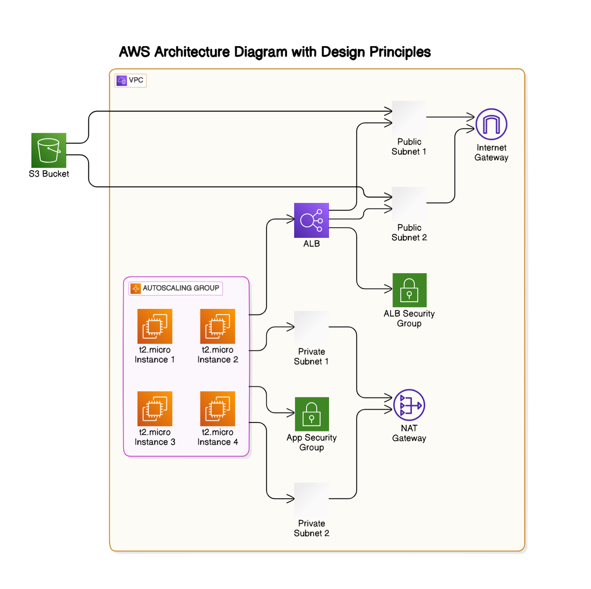

# Udagram Infrastructure Deployment


This project provisions the required infrastructure and deploys a dummy application for an Instagram-like app called Udagram.

## Files
- `network.yml`: CloudFormation template for networking resources
- `network-parameters.json`: Parameters file for the networking stack
- `udagram.yml`: CloudFormation template for application resources
- `deploy.sh`: Script to deploy the infrastructure
- `cleanup.sh`: Script to cleanup the infrastructure

## Instructions

### Deploying the Infrastructure
1. Ensure you have AWS CLI configured with appropriate permissions.
2. Run the deployment script:
   ```bash
   ./deploy.sh

### Verify if the deployment is successfull
Check [the page](http://udagra-loadb-ucshqenoccwz-1908745532.us-east-1.elb.amazonaws.com/) to see if it's saying:
`It works! Udagram, Udacity`

### Cleanup the Infrastructure
1. Ensure you have AWS CLI configured with appropriate permissions.
2. Run the deployment script:
   ```bash
   ./cleanup.sh
